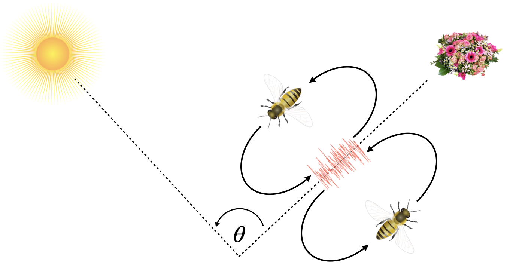

# Bees Algorithm
Implementation of the bees algorithm proposed in [_The Bees Algorithm – A Novel Tool for Complex Optimization Problems_](http://beesalgorithmsite.altervista.org/2006_-_The_Bees_Algorithm_A_Novel_Tool_for_Complex_Optimisation_Problems.pdf) based on the foraging behavior observed in honey bees colonies.

<p align="center">
    
</p>

Honey bees communicate the location of resources such as flowers with nectar through the [waggle dance](https://www.youtube.com/watch?v=LU_KD1enR3Q). The angle of the bee relative to the sun conveys information about the direction, whereas the waggle's duration has information about the distance to the source. Bees on the hive will weigh the quality of those new places and explore them accordingly.

<p align="center">
    
</p>

## Installation

To install the dependencies, run the following command:

```bash
pip install -r requirements.txt
```


## Usage

Run the algorithm from the command line with:

```python
python bees_algorithm.py
```


